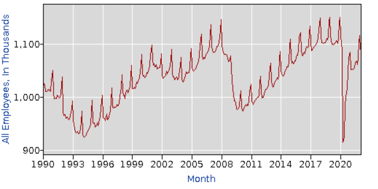

```{r setup, include=FALSE}
knitr::opts_chunk$set(echo = TRUE)
```

My initial goal of this project is to predict the unemployment rate of the Los Angeles County, so I need to build up my own data set. Currently, my data set is over ten predictor variables and the unemployment rate from 1990 to now. I will keep updating my data set to meet a minimum of 25 potential predictor variables. All variables are economic indexes presented monthly, giving me about 380 observations. These variables are all extracted from [FRED](https://fred.stlouisfed.org/series/PCE) and [US BUREAU OF LABOR STATISTICS](https://fred.stlouisfed.org/tags/series?t=los+angeles)

Basically, the predictor variables can be separated into two parts: local LA economics indicators and National economics indicators, which are all numerical variables. The selecting of predictor variables requires specific economics analysis, so I only gather a few potential predictor variables for now. 

Yes, there exists missing data for some predictor variables from 1990 to now. For some reason, one of the variables _(California Leading Index)_ was not updated anymore in 2019. I may exclude those variables without enough time range, but current data seems to be fine. Luckily, there is no missing value in the middle of time range, and this offers me to train model in a long period of time starting from 1990. 

## An overview of my research questions
As I have mentioned, I am interested in predicting the unemployment rate of Los Angeles. Here is the link of my [PROPOSAL](https://docs.google.com/document/d/117Z0RX1k7lJtnb0_Gv1VHnQgq1YNk1h-POyg3VHE4i0/edit?usp=sharing). As the response variable, the unemployment rate is _people above a specified age (usually 15)[2] not being in paid employment or self-employment but currently available for work during the reference period_(wiki). My model will be predictive, and it will be achieved by a regression approach. 

Variables especially related to unemployment should be very useful. For example, the number of employee of _Trade, Transportation, and Utilities_ section can be used to forecast the cyclical change of the unemployment rate. Also, general economics index, such as LA CPI and national GDP, can be very helpful.

{width=50%}

## Importing Unprocessed Data
I searched for local and national data on [FRED](https://fred.stlouisfed.org/series/PCE)
```{r}
unprocessed = read.csv("D:/UCSB/Spring_2022/PSTAT 131/PSTAT_131_HW/HW2/PSTAT-131/Final Project/data/unprocessed_data.csv")
head(unprocessed)
```


### Checking Missing values 

Although all variables are supposed to be numeric, but in fact some of them are imported as character variables. Also, we need to deal with missing value in columns contained "PCH" which means "Percent Change".

```{r}
library(dplyr)

unprocessed = unprocessed[-1,]
date = unprocessed[,1]

# delete NA in the first row 
unprocessed = unprocessed[,-1] %>% mutate_if(is.character, as.numeric)

unprocessed$DATE = date
unprocessed = unprocessed %>%
  select(DATE, everything())

sapply(unprocessed, function(x) sum(is.na(x)))
```


```{r}
# delete variables that have at least 8 missing values 
unprocessed = unprocessed %>% select(-APUA42172601, -CUURA421SA0_PCH,             -CUURA421SA0L1E_CHG,-LASAGRIDX, -USPTOISSUED006037, -INTDSRUSM193N) %>%
  head(-2)


sapply(unprocessed, function(x) sum(is.na(x)))
view(unprocessed)
```
 


Convert DATE column to the date type
```{r}

unprocessed$DATE = as.Date.character(unprocessed$DATE)
f
```


#EDA 
```{r}
library(xts)
x = unprocessed %>% select(DATE, CALOSA7URN) %>%
  rename(LA_unem_rate = CALOSA7URN)

LA.unem.rate = ts(x[,1:2])
LA.unem.rate = zoo(x$LA_unem_rate, x$DATE)

main <- "LA Monthly Unemployment Rate from 1990 to Now"
plot(LA.unem.rate,
     lty = "solid", main = main)
```
We discovered that there are a few well-known recession periods from 1990 to now. The collapse of internet bubble, the financial crisis of 2007, and Covid-19 pandemic all matches severe increase of the unemployment rate. We may study how different economics indexes fluctuates during the financial crisis of 2007 which is mainly caused by the mortgage debt.  


```{r}
dist.ts = function(df, col = 'residual', bins = 40)
{
  par(mfrow = c(1,2))
  temp = as.vector(df)
  breaks = seq(min(temp), max(temp), length.out = (bins + 1))
  hist(temp, breaks = breaks, main = paste('Distribution of', col), xlab = col)
  qqnorm(temp, main = paste('Q-Q Normal plot of', col))
  par(mfrow = c(1,1))
}

x = na.omit(x)
temp = as.vector(x$LA_unem_rate)
min(temp)


# take a log to shorten the range 
dist.ts(log(x$LA_unem_rate), col = "LA Unem%", bins = 50)


```
### Seasonal plots 

```{r}
library(forecast)

LA.unem.rate = ts(x$LA_unem_rate, frequency = 12, start = c(1990,2))
LA.unem.rate
ggseasonplot(LA.unem.rate)
```
Therefore, we should consider the seasonal change of the unemployment by including some predictor variables which show obvious seasonal change. One of the example is, here is the graph 


```{r}
library(GGally)
processed %>% 
  as.data.frame() %>%
  select(CALOSA7URN, APUS49A72610_CHG, APUS49A72620_PCH, APUS49A7471A_CHG) %>%
  GGally::ggpairs()
```


## Part 1 What is Unemployment Rate 

First, we must know what is the definition of the unemployment rate to understand how it is derived and what factors are related to it. A person is defined as **unemployed** in the United States if they are jobless, but have looked for work in the last four weeks and are available for work. To record unemployed, Government distributes survey to sampling population and predict the entire unemployed number in a broad area. Measuring the unemployment gives us a good overview of the ongoing status of the economy, international competition, technology development, and so on. Most importantly


The equation of the **Unemployment Rate** is 

$$unemployment \space rate = \frac{unemployed}{labor \space force}\times100$$
where _labor force_ includes all people age 16 and older who are classified as either employed and unemployed.


_Labor Force Participation Rate_


In this project, I will focus on analyzing and predicting the unemployment rate in the LA County. 


## What is the time series data and how can we manipulate it 


## Part 2 Exploratory Data Analysis 


### Population
In this section, we first have a overview of the demographic information in the Los Angeles County


```{r}
library(tidycensus)
library(tidyverse)
options(tigris_use_cache = TRUE)

census_api_key("7540e4d61b8467521425225cbe8f44f7c1667f9a")

ny <- get_acs(geography = "tract", 
              variables = "B02001_001", 
              state = "CA", 
              county = "Los Angeles", 
              year = 2020, 
              geometry = TRUE)

ggplot(ny, aes(fill = estimate)) + 
  geom_sf() + 
  theme_void() + 
  scale_fill_viridis_c(labels = scales::dollar)
```

```{r, fig.width=6, fig.height=4}
library(tidycensus)
library(tidyverse)
options(tigris_use_cache = TRUE)

#median household income 
LA <- get_acs(state = "CA", county = "Los Angeles", geography = "tract", 
                  variables = "B19013_001", geometry = TRUE,
                  year = 2020)

LA %>%
  ggplot(aes(fill = estimate)) + 
  geom_sf(color = NA) + 
  scale_fill_viridis_c(option = "magma") +
  scale_fill_viridis_c(labels = scales::dollar)

```

```{r, fig.width=6, fig.height=4}
#median age
med_age <- get_acs(state = "CA", county = "Los Angeles", geography = "tract", 
                  variables = "B01002_001", geometry = TRUE)
med_age %>%
  ggplot(aes(fill = estimate)) + 
  geom_sf(color = NA) + 
  scale_fill_viridis_c(option = "magma")
```


### Presidency Terms

In this section, I will evaluate the correlation between presidential election and the unemployment rate. The purpose is to discuss the necessity of a factor variable regarding the election terms. According to the 

According to 

### 2007-2008 Recession 

### Demographic and Aging 

The unemployment rate is related to the 


## Predictive Modeling 

### Subset a time series 


### Regression Model 

```{r}
# we delete the first row of unprocessed data
processed = ts(unprocessed,frequency = 12, start = c(1990,2)) 
colnames(processed)
```

```{r}
autoplot(processed[,c("CALOSA7URN","BBKMGDP","PSAVERT")]) +
  ylab("% change") + xlab("Year")
```

```{r}

```


### ARIMA Model 

### Deep Learning 


Good forecasts capture the genuine patterns and relationships which exist in the historical data, but do not replicate past events that will not occur again. When forecasting time series data, the aim is to estimate how the sequence of observations will continue into the future. Therefore, the main concern may be only to predict what will happen, not to know why it happens.

Finally, the time series model may give more accurate forecasts than an explanatory or mixed model.
