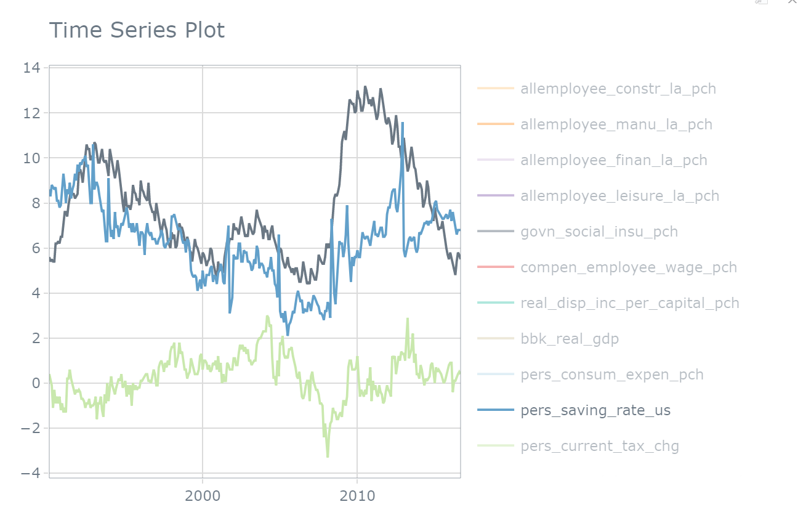

```{r setup, include=FALSE}
knitr::opts_chunk$set(echo = TRUE, message = FALSE,
                      warning = FALSE)
```


```{r include=FALSE}
# DATA Processing 
library(modeltime)
library(tidymodels)
library(tidyverse)
library(timetk)
library(lubridate)
library(tidycensus)
library(tidyverse)
library(dplyr)
library(tigris)
library(xts)
library(forecast)
library(zoo)
library(corrplot)
library(kernlab)
library(prophet)
library(plotly)
library(rules)
library(vip)
options(tigris_use_cache = TRUE)

```


# What is time-series 
A time series is a collection of observations of well-defined data items obtained through repeated measurements over time. The data points are indexed in time order. Most commonly, a time series is a sequence taken at successive equally spaced points in time. Thus it is a sequence of discrete-time data. In this project, I want to study a time series named the unemployment rate.

# What is the unemployment rate?
First, we must know what is the definition of the unemployment rate to understand how it is derived and what factors are related to it. Generally, a person is defined as **unemployed** in the United States if they are jobless, but have looked for work in the last four weeks and are available for work. To record unemployed, Government distributes survey to sampling population and predict the entire unemployed number in a broad area. Measuring the unemployment gives us a good overview of the ongoing status of the economy, international competition, technology development, and so on.

The equation of the **Unemployment Rate** is 

$$unemployment \space rate = \frac{unemployed}{labor \space force}\times100$$
where _labor force_ includes all people age 16 and older who are classified as either employed and unemployed.

These unemployment rates are general _monthly U-3 rates_(above formula) and are not seasonally adjusted or categorized by age, gender, level of education and so on. In reality, unemployment rates are usually reported with seasonally adjustment, which is a statistical technique that attempts to measure and remove the influences of predictable seasonal patterns to reveal how employment and unemployment change from month to month.


# Date Processing 
I searched and downloaded all economic data about the Los-Angeles County on Fred. Luckily, I could create a dashboard for my desired time-series and did some transformations before downloading them in a spread sheet. I controlled the range of my predictor variables. Some of time series, such as the number of employee in the manufacturing industry, has large values over time compared to those time series measured by percentage. So, I could apply natural $\log$, box-cox transformation to them; or simply, I could transform their values to the percentage of change.

The raw data was stored as _unprocessed_data.csv_, where **DATE** is a value type of date and the remaining variables are numeric. In this project, I want to formulate a way of conditioning expectations of the unemployment rate in a new, unknown economics environment where limited data are presented. I only chose local economics indicators in LA to reduce the complexity of models, but this may hurt models' ability to forecast the future impact of certain monetary polices, which can be reflected by benefits and federal interest rate. However, these indicators are all national-wide and I don't know whether they will over-represent the economics situation in LA.

```{r}
# ** initial cleaning 
# import unprocessed data
unprocessed = read.csv("data/unprocessed_data.csv")

# dealing NAs and character values(all variables should be numeric)
unprocessed = unprocessed[-1,]
date = unprocessed[,1]

# delete NA in the first row 
unprocessed = unprocessed[,-1] %>% mutate_if(is.character, as.numeric)

unprocessed$DATE = date
unprocessed = unprocessed %>%
  select(DATE, everything())

# delete variables that have at least 8 missing values 
processed_data = unprocessed %>% select(-avg_price_pipedgas_la, -new_patent_ass_la,
                                        -cpi_allitems_la, -us_interest_rate_us,
                                        -economics_cond_index_la) %>% 
  head(-2)

# Checker: no missing value 
sum(sapply(processed_data, function(x) sum(is.na(x))))

colnames(unprocessed)

```
Above is a part of our time-series data frame from 1990 to 2022. To make my more model more general, I want to exclude the Covid-19 period and only analyze data until 2016. 

```{r}
# store the processed data to the data file 
#write.csv(processed_data, "data/processed_data.csv", row.names = FALSE)


# import processed data and process it for model building 
model_data = read.csv("data/processed_data.csv")

data = model_data %>%
  mutate(DATE, DATE = as.Date.character(DATE))

# I decided to only use local economic indicators to simplify the model
data = data %>% select(DATE, contains("la"), contains("us"))
# I don't want to train my model in pandemic period

# train and test period 
data_2016 = data[1:320,] 
# test for further forecast unemployment rate in 2017
data_2017 = data[321:332,]
```

# EDA 
```{r}
# plot my selected time range 1990-2015
data_2016 %>% plot_time_series(DATE, unemploy_rate_la, 
                               .title = "LA Unemployment Rate 1990-2016")
```

This graph shows the **cyclic** pattern of economic time-series. A cyclic pattern exists when data exhibit rises and falls that are not of fixed period. For example, business cycles which usually last several years, but where the length of the current cycle is unknown beforehand.


According to above time-series graph, we discover that there are a few well-known recession periods from 1990 to 2016. For example, the collapse of internet bubble and the financial crisis of 2007 all matches severe increase of the unemployment rate. Thus, the patterns of the unemployment rate should be highly influenced by other economic indicators. Hopefully, I can use the previous economics data to forecast the unemployment rate in the future. To successfully forecast the unemployment rate, my model needs to capture two properties of time series: **seasonality** and **trend**.

## Histogram of unemployment rate

```{r}
hist(data_2016$unemploy_rate_la, breaks = 50, xlab="Unemployment Rate %",
     main = "Histogram of LA unemployment Rate")
```
The histogram of LA unemployment rate skews to the right, similar to a poisson distribution with small $\lambda$.

## Seasonality 
Now we want to discover the seasonal pattern of the unemployment rate.
```{r}
# start with Feb since we delete the first row of unprocessed data
data_2016_ts = ts(data_2016[,-1],frequency = 12, start = c(1990,2)) 

# this function requires ts object
ggseasonplot(data_2016_ts[,"unemploy_rate_la"]) +
  ggtitle("Seasonal Plot of Unemployment Rate in LA County") +
  xlab("Year") +
  ylab("Percentage%")
```

```{r}
ggsubseriesplot(data_2016_ts[,"unemploy_rate_la"]) +
  ylab("% percentage") +
  ggtitle("Seasonal subseries plot: LA Unemployment Rate")
```
From the first graph, we find that in each year, the pattern of seasonality follows a similar patterns. In the second graph, we can describe the seasonality through the variation of the blue lines. Usually, the unemployment rate decreases in the first quarter and then increase to a peak in summer. At last, the unemployment rate gradually decrease until the end of the year. This seasonality depends on different factors, such as change of tertiary industry and festival. 

## ACF and PACF 
Autocorrelation measures the linear relationship between lagged values of a time series. We can have several autocorrelation coefficients, corresponding to each 
panel in the lag plot. For example, $r_1$ measures the relationship between $y_t$ and $y_{t-1}$ and $r_2$ measures the relationship between $y_t$ and $y_{t-2}$. The value of $r_k$ is 

$$r_k = \frac{\sum_{t=k+1}^T(y_t-\overline y)(y_{t-k}-\overline y)}{\sum_{t=1}^T(y_t-\overline y)^2}$$

ACF plot is used to detect lagged features, fourier series periods, and data features via cycles.

```{r}
# ACF Diagnostics 
data_2016 %>% 
  plot_acf_diagnostics(DATA, unemploy_rate_la, .lags = 100)
```
When data have a trend, the auto-correlations for small lags tend to be large and positive because observations nearby in time are also nearby in size. So the ACF of trended time series tend to have positive values that slowly decrease as the lags increase. From the _pacf_ graph, we mainly observe the spikes exceeding the dashed blue lines. One significant spike is "lag 13", which can be considered as a yearly seasonality. 

## Unemployment vs. Predictor Variables

I can visualize different time-series predictor variables with the unemployment rate to see how they reflect the overall economics situation in the LA county. Double click the _unemployment rate in la_ and then single click _personal saving rate in the US_ and _personal current tax change in the US_, we can perceive that these three time-series share similar trend in specific time period. For example, after the 2008 mortgage crisis, all of them have a long term increasing trend. These three time series reacts similarly in the business cycle, so personal saving rate and personal current tax change should be good at forecasting the unemployment rate. 

```{r}
data_2016 %>%
  pivot_longer(-DATE) %>%
  plot_time_series(DATE, value, name, .smooth = F)
```




Then, we observe the correlation between different variables. However, it will be best to plot all the lagged features of each time series, but it is impossible to plot all of them as the number of variables exceeds 50.

```{r}
data_2016 %>% drop_na() %>%
  select(matches("(la)|(us)")) %>%
  cor() %>%
  corrplot(type = "upper", tl.pos = "td",
         method = "circle", tl.cex = 0.5, tl.col = 'black',
         order = "hclust", diag = FALSE)
```
I discover that the unemployment rate is highly correlated with _average price of electricity_, _average price of gasoline_, _home price index_ and _the number of new private housing structure issue_ in LA. Thus, I may focus on these three predictor variables when creating models. Besides, some of the predictor variables are highly correlated. For example, _federal fund effective rate_ is highly, negatively correlated with the energy price. Thus, I may create interactions between these two pairs of time-series variables. 


# Model Building 

First, I extend my data set by adding lag features I figure out from the ACF and PACF analysis. We can observe that lagged variables include "NA" at the beginning, so we should deal with these missing values when creating recipes. 
```{r}
# Creating lag and time features for machine learning algorithm 
data_2016_full <- data_2016 %>%
  bind_rows(
    # add future window for lag variables 
    future_frame(.data = ., .date_var = DATE, .length_out = 12)
  ) %>% 
  # add auto correlated lags 1, 4, 12 months (month, quarter, year)
  # used to predict seasonality 
  tk_augment_lags(contains("la"), .lags = 1) %>%
  tk_augment_lags(contains("la"), .lags = 4) %>%
  tk_augment_lags(contains("la"), .lags = 12) %>%
  tk_augment_lags(contains("us"), .lags = 1) %>%
  tk_augment_lags(contains("us"), .lags = 4) %>%
  tk_augment_lags(contains("us"), .lags = 12)
  

# view the new data 
head(data_2016_full)
```
Next, we split the data for machine learning algorithm.

```{r}
# split the data
new_splits <- initial_time_split(data_2016_full, prop = 0.9)
new_train_2016 <- training(new_splits)
new_test_2016 <- testing(new_splits)

new_splits %>%
  tk_time_series_cv_plan() %>%
  plot_time_series_cv_plan(DATE, unemploy_rate_la, .interactive = F,
                           .title = "LA Unemployment Rate 1990-2016")
```


## Helper Function for Calibration and Forecast
This function helps us calibrate and fit the new model and plot the forecast based on training set or testing set. 
```{r}
calibrate_and_plot <- function(..., type = "testing") {
  if (type == "testing") {
    new_data = new_test_2016
  } else {
    new_data = new_train_2016
  }
  
  calibration_tbl <- modeltime_table(...) %>%
    modeltime_calibrate(new_data, quiet = FALSE)
  
  print(calibration_tbl %>% modeltime_accuracy())
  
  calibration_tbl %>%
    modeltime_forecast(
      new_data = new_data,
      actual_data = data_2016_full
    ) %>%
    plot_modeltime_forecast(.conf_interval_show = FALSE)
}
```


## Auto Arima  
ARIMA is an acronym for AutoRegressive Integrated Moving Average $\text{ARIMA}(p,d,q)$ separated by first the autoregressive part and second the moving average part:

$$y'_t = c+ \phi_1 y'_{t-1} + \cdots+\phi_py'_{t-p} + \theta_1\varepsilon_{t-1} + \cdots+ \theta_q \varepsilon_{t-q}+\varepsilon_t$$
where $y'_t$ is the differenced series, $p$ is the order of the autoregressive part, 
$d$ is the degree of first differencing involved, and $q$ is the order of the moving average part. 


ARIMA is a simple algorithm that uses linear model to model lags. It performs automated differencing and recursive lag forecasting. Also, we can add fourier function to simulate seasonalities. However, ARIMA is very sensitive to number of lags and forecast can be erratic. Although regularization is not implemented, the parameter search might still cost lots of time. 

According to the documentation of **Auto ARIMA**, it selects parameters based on which ever model yields the best In-sample AIC value. During refitting, if a new parameter set yields a lower AIC value, then the new model is selected. I will create two ARIMA models. The first ARIMA model only uses date feature to produce the formula. Then, I add three predictor time series, which called "XREGS".

```{r }
# Auto ARIMA
model_fit_auto_arima <- arima_reg() %>%
    set_engine(engine = "auto_arima") %>%
    fit(unemploy_rate_la ~ DATE, 
        data = new_train_2016)

# w/ XREGS
model_fit_auto_arima_events <- arima_reg() %>%
    set_engine(engine = "auto_arima") %>%
    fit(unemploy_rate_la ~ DATE + avg_price_electr_kwh_La + avg_price_gasolone_la +
        new_private_housing_structure_issue_la + home_price_index_la, 
        data = new_train_2016)

# Calibrate
calibration_tbl_arima <- modeltime_table(model_fit_auto_arima,
                                   model_fit_auto_arima_events) %>% 
  modeltime_calibrate(new_test_2016)

# Forecast test
calibration_tbl_arima %>%
  modeltime_forecast(
    new_data = new_test_2016,
    actual_data = data_2016_full
  ) %>%
  plot_modeltime_forecast(.interactive = F)

```
Lastly, we print and compare the accuracy of both models. It seems that 

```{r}
calibration_tbl_arima %>% modeltime_accuracy() 
```

Although ARIMA(4,0,1)(2,1,1)[12] may simulate the cyclic property of the unemployment rate in the long term, it can not simulate the economic situation in a short period of time. That's why its _rmse_ is relatively high.

Clearly, after adding three predictor variables in our model, we are able to forecast local peaks in the short time of period. Then, we can keep forecasting beyond 2016 data.By checking the real values, we found that the green line(ARIMA with XREGS) does a great job on forecasting the trend and the seasonality of the unemployment rate in LA county.

```{r}
# Refit the data to the whole data set 1990-2016
# and then predict beyond 2016
refit_tbl_arima <- calibration_tbl_arima %>%
  modeltime_refit(data_2016_full)

refit_tbl_arima %>% modeltime_forecast(
  new_data = data_2017,
  actual_data = data_2016_full
  ) %>%
  plot_modeltime_forecast(
    .conf_interval_alpha = 0.05,
    .interactive = F,
    .title = "forecast beyond 2016"
  )
```

```{r include=FALSE}
splits <- initial_time_split(data_2016, prop = 0.9)

splits %>%
  tk_time_series_cv_plan() %>%
  plot_time_series_cv_plan(DATE, unemploy_rate_la)

train_2016 = training(splits)
test_2016 = testing(splits)
```


## Prophet 
Prophet is a procedure for forecasting time series data based on an additive model where non-linear trends are fit with yearly, weekly, and daily seasonality, plus holiday effects. It works best with time series that have strong seasonal effects and several seasons of historical data. Also, it can be considered as a nonlinear regression model of the form:

$$y_t = g(t) + s(t)+h(t) + \epsilon_t$$
where $g(t)$ describes a piecewise-linear trend, $s(t)$ describes the various seasonal patterns, $h(t)$ captures the holiday effects, and $\epsilon_t$ is a white noise error term. 

We use the same idea from Auto ARIMA model to produce prophet models since it is also an auto method, except it has two parameters to tweak.  
_changepoint_range_: Adjusts the flexibility of the trend component by limiting to a percentage of data before the end of the time series.    
_changepoint_num_: Number of potential change points to include for modeling trend

```{r}
#Prophet 
model_fit_prophet <- prophet_reg(
  changepoint_num = 20,
  changepoint_range = 0.9
) %>%
    set_engine(engine = "prophet") %>%
    fit(unemploy_rate_la ~ DATE, data = train_2016)

model_fit_prophet_xregs <- prophet_reg(
  changepoint_num = 20,
  changepoint_range = 0.9,
  seasonality_yearly = 1
) %>%
    set_engine(engine = "prophet") %>%
    fit(unemploy_rate_la ~ DATE + avg_price_electr_kwh_La + avg_price_gasolone_la +
        new_private_housing_structure_issue_la, data = train_2016)

modeltime_table(
  model_fit_prophet,
  model_fit_prophet_xregs
) %>% modeltime_calibrate(new_data = test_2016) %>%
  modeltime_forecast(
    new_data = test_2016,
    actual_data = data_2016
  ) %>%
  plot_modeltime_forecast(.interactive = F)
```
The forecast graphs shows that the prophet model wrongly predicts the trend in the testing set. Therefore, we want to visualize the effect of key parameters on the prophet model to find out what happen. No matter what I adjust the change point _range and number_, the forecast graph does not change. In the following graph, the blue line describe the behavior of the prophet model. 

```{r}
# observe how the prophet model behaves 
prophet_model <- model_fit_prophet$fit$models$model_1

prophet_fcst <- predict(prophet_model, 
                        newdata = train_2016)

g <- plot(prophet_model, prophet_fcst) +
  add_changepoints_to_plot(prophet_model) 
  
ggplotly(g)
```
It seems that prophet model does not discover the change of trend after 2010 and predict the unemployment rate would keep growing. I may hypothesize that the growth of unemployment rate during Mortgage Crisis is so influential that the model ignores the slightly decrease afterward. Without detecting the decrease trend at the end of training set, even the XREGS cannot save the forecast. Although the prophet model may perform well if I extend the training set, this shortcoming pushes me to upgrade the prophet model. The answer is boosting. 


## Recipe
First, I need to create a base recipe by adding time-series signature and only preserving monthly and yearly features. After making sure my recipe only contains numeric and dummy variables, I remove the character "DATE" values and all rows with "NA". Then, I create a spline and lag recipe for the model fitting. The spline recipe simply uses the data feature and predictor variables to forecast the future value, while the lag recipe uses previous data to forecast. 

I present the spline and lag recipe below. 
```{r}
# base recipe 
recipe_spec_base <- recipe(unemploy_rate_la ~., data = new_train_2016) %>%
  step_timeseries_signature(DATE) %>%
  # feature removal
  step_rm(matches("(iso)|(xts)|(hour)|(minute)|(second)|(am.pm)|(day)|(week)")) %>%
  # standardization
  step_normalize(matches("(index.num)|(year)|(issue)")) %>%
  # month feature is converted to dummy variables 
  step_dummy(all_nominal(), one_hot = TRUE) 

recipe_spec_spline <- recipe_spec_base %>% 
  step_rm(DATE) %>%
  step_ns(ends_with("index.num")) %>%
  step_rm(matches("lag"))

# lag recipe 
#recipe_spec_lag <- recipe_spec_base %>%
  #step_rm(DATE) %>%
  #step_ns(ends_with("index.num")) %>%
  #step_naomit(matches("lag"))

recipe_spec_spline %>% prep() %>% juice() %>% glimpse()
```

## Cross Validation and Visualization
In the cross validation process, I set number of partitions as 5 and plot each k-fold 
```{r}
set.seed(123)
resample_kfold <- new_train_2016 %>% vfold_cv(v = 5)

resample_kfold %>%
  tk_time_series_cv_plan() %>%
  plot_time_series_cv_plan(DATE, unemploy_rate_la)
```


## GLMNET 
GLMNET is called "Lasso and Elastic-Net Regularized Generalized Linear Models" and is an efficient procedure for fitting the entire lasso or elastic-net regularization path for linear regression. 

**Penalty**: A non-negative number representing the total amount of regularization  
**Mixture**: number between 0 and 1 characterizing lass and ridge regularization

1. Set up the model and tuning grid
```{r}
model_spec_glmet <- linear_reg(
  mode = "regression",
  penalty = tune(),
  mixture = tune()
) %>%
  set_engine("glmnet") 

 
wflw_glmnet_spline <- workflow() %>%
  add_model(model_spec_glmet) %>%
  add_recipe(recipe_spec_spline)

penalty_grid <- grid_regular(penalty(range = c(-5, 5)),
                             mixture(range = c(0,1)),
                             levels = c(mixture = 10, penalty = 10))

head(penalty_grid,15)
```


2. Tuning and plot the result
```{r}
load(file = "models/GLMNET.rds")
#tune_glmnet <- tune_grid(
  #wflw_glmnet_spline,
  #resamples = resample_kfold,
  #grid = penalty_grid
#)

autoplot(tune_glmnet)
```

3. Best model for GLMNET 
```{r}
best_glmnet_mod <- select_best(tune_glmnet, metric = "rmse")
best_glmnet_mod
```
4. Fit and Forecast GLMNET 
```{r}
final_glmnet = finalize_workflow(wflw_glmnet_spline, best_glmnet_mod)

final_glmnet_fit <- final_glmnet %>% fit(new_train_2016)
calibrate_and_plot(final_glmnet_fit)
```
The GLMNET model with spline recipe does not forecast well in the testing set. When I was playing with lag recipe, the result is very good. However, I don't know why the lag recipe cannot work with the cross-validation process. Thus, I should figure out this problem for further study. 

## Multivariate Adaptive Regression Spline model
MARS is a non-parametric regression technique and can be seen as an extension of linear models that automatically models nonlinearities and interactions between variables. Here are its two key parameters we need to tune. 

**num_terms**: The number of features that will be retained in the final model, including the intercept
**prod_degree**: The highest possible interaction degree

1. Set up the model and tune grid
```{r}
model_spec_earth_tune <- mars(
  mode = "regression",
  num_terms = tune(),
  prod_degree = tune()
) %>% set_engine("earth")

wflw_spec_earth_tune <- workflow() %>%
  add_model(model_spec_earth_tune) %>%
  add_recipe(recipe_spec_spline)

earth_grid <- grid_regular(num_terms(range = c(1, 25)),
                             prod_degree(range = c(1,10)),
                             levels = c(num_terms = 10, prod_degree = 10))

head(earth_grid,20)
```
2. Tuning and plot the result
```{r}
#tune_earth <- tune_grid(
  #wflw_spec_earth_tune,
  #resamples = resample_kfold,
  #grid = earth_grid
#)
load(file = "models/MARS.rds")

autoplot(tune_earth)
```

3. Best MARS Model 
```{r}
best_earth_mod <- select_best(tune_earth, metric = "rmse")
best_earth_mod
```

4. Fit and Forecast Best MARS with accuracy
```{r}
final_earth = finalize_workflow(wflw_spec_earth_tune, best_earth_mod)

final_earth_fit <- final_earth %>% fit(new_train_2016)
calibrate_and_plot(final_earth_fit)
```
The MARS model forecasts well at first, but the later bounce back is very harsh and in advance. I suppose some variables with significant parameters reach to an outlier, causing the forecast graph to be abnormal. Therefore, it is important to normalize and exclude outliers for the predictor variables in the recipe section. 


## XGBoost (Gradient Boosting Machine) - Tree-Based
XGBoost is an implementation of gradient boosted decision trees designed for speed and performance. Here are three main key parameters I want to tune. I give up tuning "learn_rate" and "loss reduction" since five parameters overall cost too much computation. 

**mtry:** the number of predictors that will be randomly sampled at each split when creating the tree models  

**trees:** An integer for the number of trees contained in the ensemble

**min_n: ** An integer for the minimum number of data points in a node that is required for the node to be split further

1. Set up the XGBoost Model and tune grid
```{r}
# XGBOOST TUNE
model_spec_xgboost_tune <- boost_tree(
  mode = "regression",
  mtry = tune(),
  trees = tune(),
  min_n = tune()
) %>%
  set_engine("xgboost")

wflw_spec_xgboost_tune <- workflow() %>%
  add_model(model_spec_xgboost_tune) %>%
  add_recipe(recipe_spec_spline)


boost_grid <- grid_regular(mtry(range = c(1,20)),
                           trees(range = c(50,800)),
                           min_n(range = c(2,30)),
                           levels = 8
                           )

head(boost_grid)

```

2. tune and plot the result   
```{r}
#tune_boost <- tune_grid(wflw_spec_xgboost_tune,
                        #resamples = resample_kfold,
                        #grid = boost_grid)
load(file = "models/XGBoost.rds")
autoplot(tune_boost)
```
We discover that the model does not prefer large **min_n** to achieve low "rmse", and

3. Select the best boost model
```{r}
best_boost_mod <- select_best(tune_boost, metric = "rmse")
best_boost_mod
```
4. Calibrate and ouput the forecast result
```{r}
final_boost = finalize_workflow(wflw_spec_xgboost_tune, best_boost_mod)

final_boost_fit <- final_boost %>% fit(new_train_2016)
calibrate_and_plot(final_boost_fit)
```
From the above graph and accuracy, the XGBoost also downplays the forecast in the testing set. The "rmse" is nearly 2.4 and $R^2$ is low, strengthening my hypothesis that the lag feature is irreplaceable in the time-series forecast.

5. Graph the vip plot 
```{r}
final_boost_fit %>%
  extract_fit_parsnip() %>%
  vip()
```

This vip graphs shows that the federal fund effective rate weights a lot when building the tree algorithm. However, the remaining factors are all date features. The problem is the date feature does well in simulate the long-term cyclic pattern of time-series but not short-period fluctuation. 


## Prophet with Boost 
For some reasons, my recipe with lag features returned prediction error when I was doing cross validation with above models. Therefore, to include lag features in my model, I decide to utilize prophet boost, which derive lagged features for me. Although the simple prophet model does not work well with `new_train_2016`, hopefully adding the tree features will enhance the prophet model performance. 

1. Set up the model and tune grid 
```{r}
## XGBoost will model seasonality with the prophet model's residuals using 
## calendar features from the recipe spec 
model_prophet_boost_tune <- prophet_boost(
      seasonality_yearly = TRUE,
      seasonality_weekly = FALSE,
      seasonality_daily = FALSE,
      mtry = tune(),
      trees = tune(),
      min_n = tune()
    ) %>%
      set_engine("prophet_xgboost")


wflw_prophet_boost_tune <- workflow() %>%
  add_model(model_prophet_boost_tune) %>%
  add_recipe(recipe_spec_base)


boost_grid <- grid_regular(mtry(range = c(1,20)),
                           trees(range = c(50,800)),
                           min_n(range = c(2,30)),
                           levels = 8
                           )

```

2. tuning and plot the result 
```{r}
#tune_prophet_boost <- tune_grid(wflw_prophet_boost_tune,
                        #resamples = resample_kfold,
                        #grid = boost_grid)

load(file = "models/prophet_boost.rds")
autoplot(tune_prophet_boost)
```
3. select the best model 
```{r}
best_prophet_boost_mod <- select_best(tune_prophet_boost, metric = "rmse")
best_prophet_boost_mod
```
4. fit the best model and output the forecast result 
```{r}
final_prophet_boost = finalize_workflow(wflw_prophet_boost_tune, best_prophet_boost_mod)

final_prophet_boost_fit <- final_prophet_boost %>% fit(new_train_2016)
calibrate_and_plot(final_prophet_boost_fit)
```
Unluckily, the prophet model with boosting still cannot escape the upward trending before 2010.

# 2022 forecast 
After finding the best model: AUTO ARIMA, I can achieve my final goal to forecast the later unemployment rate in 2022. Before doing this, I want to present two interesting graphs. 

## Interesting Spatial Analysis 
The below graph shows that over recent five years, the Los Angeles County was losing its population.
```{r}
census_api_key("7540e4d61b8467521425225cbe8f44f7c1667f9a")
net_migration <- get_estimates(geography = "county", state = "CA",
                               variables = "RNETMIG",
                               year = 2019,
                               geometry = TRUE,
                               resolution = "20m") %>%
  shift_geometry()

order = c("-15 and below", "-15 to -5", "-5 to +5", "+5 to +15", "+15 and up")

net_migration <- net_migration %>%
  mutate(groups = case_when(
    value > 15 ~ "+15 and up",
    value > 5 ~ "+5 to +15",
    value > -5 ~ "-5 to +5",
    value > -15 ~ "-15 to -5",
    TRUE ~ "-15 and below"
  )) %>%
  mutate(groups = factor(groups, levels = order))

state_overlay <- states(
  cb = TRUE,
  resolution = "20m"
) %>%
  filter(GEOID != "72") %>%
  shift_geometry()

ggplot() +
  geom_sf(data = net_migration, aes(fill = groups, color = groups), size = 0.1) + 
  scale_fill_brewer(palette = "PuOr", direction = -1) +
  scale_color_brewer(palette = "PuOr", direction = -1, guide = FALSE)  +
  labs(title = "Net migration per 1000 residents in CA",
       subtitle = "US Census Bureau 2019 Population Estimates",
       fill = "Rate") +
  theme_minimal(base_family = "Roboto")
```


This graph about median age in La show that the aging problem can influence the unemployment rate in some ways.   
```{r, fig.width=6, fig.height=4}
#median age
med_age <- get_acs(state = "CA", county = "Los Angeles", geography = "tract", 
                  variables = "B01002_001", geometry = TRUE)
med_age %>%
  ggplot(aes(fill = estimate)) + 
  geom_sf(color = NA) + 
  scale_fill_viridis_c(option = "magma")
```

Since this kind of census data is measured five-year a time, I cannot put it into my data set. But intuitively, this is another way to address my initial goal to study the unemployment rate. 

I create a training set for the recent forecast 
```{r}
data_2022 = data[200:375,]
test_data_2022 = data[376:385,]
```

```{r}
refit_tbl_arima <- calibration_tbl_arima %>%
  modeltime_refit(data_2022)

refit_tbl_arima %>% modeltime_forecast(
  new_data = test_data_2022,
  actual_data = data_2022
  ) %>%
  plot_modeltime_forecast(
    .conf_interval_alpha = 0.05,
    .interactive = F,
    .title = "GREEN LINE REGRESSION WITH ARIMA(1,1,0)(2,0,0)[12]"
  )
```

```{r}
data[200:385,] %>% plot_time_series(DATE, unemploy_rate_la, 
                               .title = "REAL LA Unemployment Rate 2022")
```
We find that the green line successfully forecast the trend of the unemployment rate in 2022. Therefore, ARIMA with XRGE is a reliable model for time series. 


# Conclusion
It turns out that the AUTO ARIMA produces the best forecast for the unemployment rate in LA, and only the MARS model stands out among all my machine learning models. Time series machine learning is a very challenging task for me, because I have to learn a lot about time-series featuring and engineering before applying machine learning to forecast. 

It's a pity that I wasn't able to use the lag recipe to train all my machine learning models due to some reasons, and my results are not decent. I think I need to solidify my understanding of time-series before doing this project, but I did try my best. The spline recipe does not contain the lag feature, making models less applicable in the real-world problem. 

Besides, I really want to utilize the neural network, but the "nnetar_reg()" function keeps complaining about too many weights during model building. Although I am able to build a single hidden layer network, I requires huge number of units inside that layer and long epochs to achieve a small "rmse". It takes too much time to train and is very ineffcient. 


